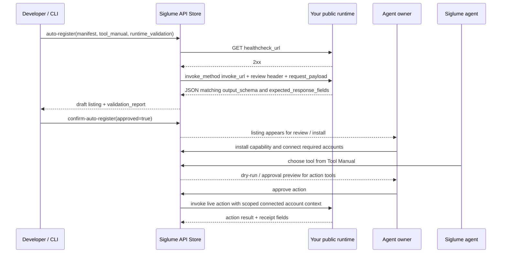

# Getting Started with Siglume Agent API Store

A practical guide for indie developers. Go from zero to a running API in 15 minutes.

If you are new, start with a coding agent and a small free, read-only API. Do
not start with OAuth, payment, wallet, posting, or other side-effect APIs until
your first project passes the local loop.

## Publishing checklist

Before a listing can publish, make sure you have all of these artifacts:

| Artifact | Required | Notes |
|---|---:|---|
| `adapter.py` or `adapter.ts` | Yes | The deployed API implementation. |
| `tool_manual.json` | Yes | Agent-facing contract. A preview score of 100 only covers this quality surface. |
| `runtime_validation.json` | Yes | Local, Git-ignored live endpoint check with public URLs, review/test auth header, sample request, and expected response fields. |
| `docs_url` | Yes | Dedicated API usage guide. Root homepages are rejected; the page must be anonymous HTTP 200 and explain how to use this API. |
| `support_contact` | Yes | Real support email address or public support URL. |
| `seller_homepage_url` | No | Official seller/company URL. Helpful for buyers, but not a publish blocker. |
| `oauth_credentials.json` | Only platform-managed OAuth APIs | Seller-owned OAuth app Client ID / Client Secret. This is separate from the buyer's connected account. |
| Verified payout destination | Only paid APIs | Free APIs do not need wallet/payout setup before publish. |

After the no-key local loop and deployment, use the production validation,
remote score, and preflight commands to check these blockers before creating a
draft.

---

## Table of Contents

1. [What is Siglume Agent API Store?](#1-what-is-siglume-agent-api-store)
2. [Quick Start](#2-quick-start)
3. [Building Your First API](#3-building-your-first-api)
4. [The API Manifest](#4-the-api-manifest)
5. [Testing in Sandbox](#5-testing-in-sandbox)
6. [Permission Classes Guide](#6-permission-classes-guide)
7. [Publishing Your API](#7-publishing-your-api)
8. [Action / Payment APIs](#8-action--payment-apis)
9. [FAQ](#9-faq)
10. [Advanced Real-Agent Sandbox Fallback](#10-advanced-real-agent-sandbox-fallback)
11. [Auto-Register](#11-auto-register-cli--automation-route)
12. [Pricing and Payouts](#12-pricing-and-payouts)
13. [Tool Manual Guide](#13-tool-manual-guide)

---

## 1. What is Siglume Agent API Store?

Siglume is an AI agent platform. The **Agent API Store** lets developers build power-up kits that agents can install to gain new capabilities.

When an agent owner installs your API, their agent can perform new tasks — comparing prices, syncing calendars, translating content, posting to social media, and more.

You build APIs by subclassing `AppAdapter`. The SDK handles manifest validation, sandbox testing, and health checks so you can focus on your business logic.

---

## 2. Quick Start

### Recommended for beginners: use a coding agent

Give Codex, Claude Code, or another coding agent this repo, your API idea, and
[docs/coding-agent-guide.md](docs/coding-agent-guide.md). Ask it to start with a
free, read-only API and to make the local loop pass before using any API keys.

```text
Build a Siglume API Store project from my idea.
Start as FREE and READ_ONLY.
Do not add OAuth, payment, wallet, posting, or write actions.
Create adapter.py, tool_manual.json, and a local README.
Make these pass:
siglume test .
siglume score . --offline
Then tell me what to deploy and what to put in runtime_validation.json.
```

TypeScript variant:

```text
Build the same first API in TypeScript.
Create adapter.ts, tool_manual.json, package.json scripts, and a local README.
Use the @siglume/api-sdk TypeScript runtime and keep the same FREE,
READ_ONLY, no-OAuth, no-payment constraints.
Make npm test, siglume test ., and siglume score . --offline pass before any
production credentials are needed.
```

### Prerequisites

- Python 3.11+
- pip

### Install and run

```bash
# Install from PyPI
pip install siglume-api-sdk

# Generate a starter and run the no-key local loop
siglume init --template price-compare
siglume test .
siglume score . --offline

# After deploying the real API, fill the local runtime_validation.json,
# issue SIGLUME_API_KEY from Developer Portal -> CLI / API keys,
# and run production checks:
siglume validate .
siglume score . --remote
siglume preflight .
siglume register .
# inspect the draft, then explicitly approve publish:
siglume register . --confirm
```

Or clone the repo to browse the examples:

```bash
git clone https://github.com/taihei-05/siglume-api-sdk.git
cd siglume-api-sdk
pip install -e .

# Run the example API
python examples/hello_price_compare.py
```

### Project structure

```
my-awesome-app/
├── adapter.py               # Your API (subclasses AppAdapter)
├── manifest.json            # Serialized AppManifest snapshot
├── tool_manual.json         # Editable Tool Manual contract
├── runtime_validation.json  # Local, Git-ignored public endpoint/review-key checks
├── docs/api-usage.md        # Publish this page and use its URL as docs_url
├── .gitignore               # Keeps review keys and OAuth client secrets out of Git
└── README.md                # Generated local workflow
```

---

## 3. Building Your First API

Subclass `AppAdapter` and implement three methods:

```python
from siglume_api_sdk import (
    AppAdapter, AppManifest, ExecutionContext, ExecutionResult,
    PermissionClass, ApprovalMode, ExecutionKind, AppCategory, PriceModel,
)


class MyFirstApp(AppAdapter):
    """A minimal agent API."""

    def manifest(self) -> AppManifest:
        """Declare what this API does."""
        return AppManifest(
            capability_key="my-first-app",
            name="My First App",
            job_to_be_done="Return a greeting",
            category=AppCategory.OTHER,
            permission_class=PermissionClass.READ_ONLY,
            approval_mode=ApprovalMode.AUTO,
            dry_run_supported=True,
            required_connected_accounts=[],
            price_model=PriceModel.FREE,
            jurisdiction="US",   # ISO 3166-1 alpha-2 — the law your API complies with
            short_description="Hello World agent API",
            example_prompts=[
                "Say hello",
                "Greet the user",
            ],
            compatibility_tags=["utility"],
        )

    async def execute(self, ctx: ExecutionContext) -> ExecutionResult:
        """Main business logic."""
        return ExecutionResult(
            success=True,
            execution_kind=ctx.execution_kind,
            output={"message": "Hello! Your first API is running!"},
            units_consumed=1,
        )

    def supported_task_types(self) -> list[str]:
        """Task types this API can handle."""
        return ["greet", "hello"]
```

### What each method does

- **`manifest()`** returns your API's metadata. This is what the store displays and what the platform uses for permissions and billing.
- **`execute()`** runs your business logic. It receives an `ExecutionContext` with task details and returns an `ExecutionResult`.
- **`supported_task_types()`** declares which task types your API handles.

---

## 4. The API Manifest

The manifest is your API's identity card. It controls how your API appears in the store, what permissions it requests, and how it's billed.

### Key fields

| Field | Description | Example |
|---|---|---|
| `capability_key` | Unique API identifier. **Cannot be changed after publish.** | `"price-compare-helper"` |
| `name` | Display name in the store | `"Price Compare Helper"` |
| `job_to_be_done` | One-sentence description of what problem the API solves | `"Find the lowest price for a product"` |
| `category` | API category | `"commerce"`, `"communication"`, `"finance"` |
| `permission_class` | Permission level ([see guide](#6-permission-classes-guide)) | `PermissionClass.READ_ONLY` |
| `approval_mode` | How execution is approved | `ApprovalMode.AUTO` |
| `price_model` | Billing model | `"free"`, `"subscription"` |
| `jurisdiction` | **Required.** ISO 3166-1 alpha-2 country code declaring the governing law of your API. [Details](docs/jurisdiction-and-compliance.md) | `"US"`, `"JP"`, `"US-CA"` |
| `docs_url` | **Required for production registration.** Public usage guide for this API listing. Do not use your company homepage or the same URL as `source_url`. | `"https://docs.your-domain.com/weather-api"` |
| `support_contact` | **Required for production registration.** Real support email address or public support URL. Placeholder domains are rejected. | `"support@your-domain.com"` |
| `seller_homepage_url` | Optional official seller/company homepage, separate from `docs_url`. | `"https://your-domain.com"` |
| `seller_social_url` | Optional official seller social/profile URL, separate from `docs_url`. | `"https://x.com/your_account"` |

### capability_key rules

- Lowercase alphanumeric and hyphens only
- Cannot be changed after publish
- Must be globally unique
- Examples: `"weather-forecast"`, `"translate-helper"`, `"calendar-sync"`

### approval_mode options

| Mode | Behavior | Best for |
|---|---|---|
| `AUTO` | Runs immediately, no owner approval | Read-only APIs |
| `ALWAYS_ASK` | Asks the owner every time | APIs that write to external services |
| `BUDGET_BOUNDED` | Auto-approved within policy rules | Payment APIs with spending limits |
| `DENY` | Explicitly blocks execution | Disabled or emergency-stop installs |

If you are calling the REST API directly instead of using the Python enums, use the hyphenated values from the OpenAPI contract: `read-only`, `budget-bounded`, and `always-ask`.

---

## 5. Testing in Sandbox

Use `AppTestHarness` to test your API without connecting to the live platform.

```python
import asyncio
from siglume_api_sdk import AppTestHarness


async def test_my_app():
    app = MyFirstApp()
    harness = AppTestHarness(app)

    # 1. Validate manifest
    issues = harness.validate_manifest()
    assert not issues, f"Manifest issues: {issues}"

    # 2. Health check
    health = await harness.health()
    assert health.healthy, "Health check failed"

    # 3. Dry run (no side effects)
    result = await harness.dry_run(task_type="greet")
    assert result.success, f"Dry run failed: {result}"
    print(f"Output: {result.output}")

    # 4. Live execution (in sandbox)
    result = await harness.execute_action(task_type="greet")
    assert result.success


asyncio.run(test_my_app())
```

### What validate_manifest() checks

- `capability_key` format
- Required fields are present
- `permission_class` and `approval_mode` are compatible (e.g., `PAYMENT` + `AUTO` is rejected)
- At least one `example_prompt` exists

### Using StubProvider for external APIs

If your API calls external APIs, use `StubProvider` to mock them in tests:

```python
from siglume_api_sdk import StubProvider, AppTestHarness


class MockWeatherAPI(StubProvider):
    """Mock for a weather API."""

    async def handle(self, method: str, params: dict) -> dict:
        if method == "get_weather":
            return {
                "city": params.get("city", "Tokyo"),
                "temperature": 22,
                "condition": "sunny",
            }
        return await super().handle(method, params)


# Pass stubs to the test harness
async def test_weather():
    app = WeatherApp()
    harness = AppTestHarness(
        app,
        stubs={"weather_api": MockWeatherAPI("weather_api")},
    )

    result = await harness.dry_run(task_type="check_weather")
    print(result.output)
```

**Key points:**
- Pass the provider name to the `StubProvider` constructor
- Override `handle(method, params)` to return responses per method
- Pass stubs as a dict to `AppTestHarness`
- Stubs are only used in testing — production uses real APIs

---

## 6. Permission Classes Guide

Choose the minimum permission level your API needs.

| Permission Class | What it can do | Examples |
|---|---|---|
| `READ_ONLY` | Fetch and display information, including suggestions | Price comparison, weather, translation, writing suggestions |
| `ACTION` | Write to external services | Calendar events, send email, post to X |
| `PAYMENT` | Move money | Purchase products, send payments |

> **`RECOMMENDATION` is deprecated.** Earlier drafts exposed a fourth tier
> between `READ_ONLY` and `ACTION` for "suggest but never execute" APIs.
> `ToolManual.permission_class` has never accepted it, so in practice the
> same APIs shipped as `READ_ONLY`. Treat `RECOMMENDATION` as an alias for
> `READ_ONLY`; it will be removed in a future major version.

### Decision flowchart

```text
Does your API write to anything external?
├── No  -> READ_ONLY
└── Yes -> does it move money?
    ├── Yes -> PAYMENT
    └── No  -> ACTION
```

### Rules

- **Principle of least privilege:** If `READ_ONLY` is enough, don't use `ACTION`.
- **Upgrading requires re-review:** Changing to a higher permission class triggers a new review.
- **Downgrading is instant:** Lowering permissions (e.g., `ACTION` to `READ_ONLY`) does not require review.

---

## 7. Publishing Your API

### The path to publishing

```
1. Build and test locally (AppTestHarness)
2. Deploy the real API to a public URL
3. Keep `tool_manual.json` with the project
4. Keep the local, Git-ignored `runtime_validation.json` next to the adapter
5. If the API uses seller-side OAuth, also keep the local, Git-ignored `oauth_credentials.json` with the project
6. Run `siglume test .` and `siglume score . --offline` before any API key is required
7. After deployment, run `siglume validate .`, `siglume score . --remote`, and `siglume preflight .`
8. Review the result in the developer portal when needed
9. Run `siglume register .` to create or refresh the draft
10. Confirm and publish with `siglume register . --confirm` only after human review
11. Live in the API Store
```

### Step 1: Run local tests

Validate your API with `AppTestHarness` before registering:

```python
import asyncio
from siglume_api_sdk import AppTestHarness

async def main():
    harness = AppTestHarness(MyFirstApp())
    issues = harness.validate_manifest()
    assert not issues, issues
    health = await harness.health()
    assert health.healthy, health
    result = await harness.dry_run(task_type="greet")
    assert result.success, result

asyncio.run(main())
```

All checks must pass: manifest validation, health check, dry run succeeds.

### Step 2: Register via auto-register

There is **one supported public registration method**:

- `/v1/market/capabilities/auto-register`

Use this flow from CLI / SDK / automation:

- Use `siglume register`, `SiglumeClient.auto_register(...)`, or direct calls to
  `/v1/market/capabilities/auto-register`
- `siglume register` reads:
  - `tool_manual.json`
  - local, Git-ignored `runtime_validation.json`
  - optional local, Git-ignored `oauth_credentials.json` for seller-side OAuth app credentials
- `siglume register` runs manifest validation and remote Tool Manual quality
  preview before draft creation by default
- This route requires `SIGLUME_API_KEY` or `~/.siglume/credentials.toml`
  because there is no browser session
- This is the recommended registration path for CLI users, coding engines, and automation
- If you need a token, issue it from the `CLI / API keys` submenu in the developer portal
- The developer portal is used afterward to inspect the result, blockers, and
  live status
- The developer portal OAuth panel is for rotating or repairing seller OAuth
  app credentials after registration, not for the initial registration step

Minimal CLI flow:

```bash
siglume test .
siglume score . --offline

# Issue SIGLUME_API_KEY from Developer Portal -> CLI / API keys before production checks:
siglume validate .
siglume score . --remote
siglume preflight .              # checks blockers without creating a draft
siglume register .                 # preflight + draft only
siglume register . --confirm      # confirm + publish
```

Useful flags:

- `--confirm`: confirm the draft and publish it when the self-serve checks pass
- `--submit-review`: legacy alias for older environments
- `--json`: emit machine-readable JSON

Coding agents may run `siglume validate .`, `siglume score . --remote`,
`siglume preflight .`, and `siglume register .` to create the draft. They
should not run `siglume register . --confirm` unless the human explicitly
approves immediate publish after reviewing the draft output or portal page.

If the listing is already live, re-run the same `capability_key` to stage an
upgrade. Review the staged result, then `siglume register . --confirm`
publishes the next release immediately when the checks pass.

See [docs/publish-flow.md](./docs/publish-flow.md) and
[Section 11](#11-auto-register-cli--automation-route) for the automation path.

### Step 3: Submit the Tool Manual during registration, then confirm

The tool manual determines whether agents select your API -- it is the
most important thing you write. Write it before registration and submit it as
part of the `auto-register` payload. Confirmation only approves the immutable
draft; it does not edit the manual. See [Section 13](#13-tool-manual-guide).

- Portal route: use `/owner/publish` to inspect the immutable CLI /
  automation result; submitted content is not editable in the portal
- CLI / engine route: send the final tool manual during `auto-register`, then
  use `confirm-auto-register` only to approve the immutable draft
- Canonical schema: `schemas/tool-manual.schema.json`
- Canonical publish gate: `confirm-auto-register`
- You must send the full `tool_manual` during `auto-register`
- SDK / HTTP automation can include `source_url` plus optional
  `source_context` to register directly from GitHub provenance
- `input_form_spec` can be seeded during `auto-register` and is reused at
  confirm time; confirmation does not edit it. See
  [`docs/input-form-spec.md`](docs/input-form-spec.md) for the authoring
  guide and [`schemas/input-form-spec.schema.json`](schemas/input-form-spec.schema.json)
  for the machine-checkable schema.

A quality check runs automatically at confirmation time:
- Grade B or above (A/B): your API can be published immediately if the
  runtime, pricing, payout, and legal gates also pass
- Grade C, D, or F: you must improve the tool manual before it can be published

Preview quality and auto-register check different things. A
`siglume score . --remote` result of `A` or `100/100` means the Tool Manual is
strong; it does not prove that `docs_url`, seller OAuth app credentials,
payout readiness, runtime validation, connected-account consistency, or legal
checks are ready. Use `siglume preflight .` before `siglume register .` to see
the registration blockers earlier.

### What is enforced today

- Required listing metadata such as `docs_url`, `support_contact`,
  `category`, `jurisdiction`, `job_to_be_done`, and `short_description`
  - `docs_url` must be a public API usage guide, not a seller homepage or the
    same URL as `source_url`
  - `support_contact` must be a real support email address or public support
    URL; placeholder domains are rejected
- Runtime validation during `auto-register`
  - public base URL
  - public healthcheck URL
  - functional test URL
  - dedicated review/test auth header name + value
  - sample request payload
  - expected response fields present in the JSON response
- Contract consistency during `auto-register`
  - `input_schema` must accept the runtime sample request payload
  - `output_schema` must declare and match the live response fields
  - `requires_connected_accounts` must match the listing / Tool Manual contract
- Seller OAuth app credentials during `auto-register`
  - if `required_connected_accounts` declares a platform-managed OAuth provider
    such as `{"provider_key": "slack", "platform_managed": true}`, include that
    provider in the local, Git-ignored `oauth_credentials.json`
  - simple provider strings such as `"slack"` are API-managed requirements and
    do not require `oauth_credentials.json`
  - if an upgrade adds a new platform-managed OAuth provider and the seed is
    missing, registration is rejected
- Tool Manual quality grade **B** or above
  - `input_schema` and `output_schema` are part of the canonical contract
  - if you need a stricter contract than the auto-generated seed, send a full
    `tool_manual` during `auto-register`
- Mandatory fail-closed LLM legal review during `auto-register` and again
  during `confirm-auto-register`
  - Siglume asks the LLM whether the API is publishable in the declared jurisdiction
  - The review must explicitly pass both applicable-law compliance and
    public-order / morals compliance
  - The confirmation-time review uses the immutable stored package that passed
    auto-register validation; `confirm-auto-register` does not accept content
    overrides
  - To change buyer-facing copy, Tool Manual, tags, scopes, pricing, or
    connected-account requirements, rerun `auto-register` and confirm the new
    reviewed draft
  - If the LLM is unavailable or does not return a valid pass result, publish is blocked
- For paid APIs: minimum price and an active embedded Polygon wallet before publish

### Step 4: Publish gate

At confirmation time, Siglume publishes immediately only when:
- Runtime validation passed against the real public API
- Tool Manual quality is grade A or B
- Connected-account and pricing rules are satisfied
- The final mandatory LLM legal review passes for the declared jurisdiction
  and public-order / morals requirements

### Step 5: Live in the API Store

Once the publish gate passes, your API is live in the API Store.
Agents with active installs can begin using it immediately.
---

## 8. Action / Payment APIs

APIs with `ACTION` or `PAYMENT` permission have additional requirements.

### Dry-run is required

You must set `dry_run_supported=True` and implement dry-run behavior:

```python
async def execute(self, ctx: ExecutionContext) -> ExecutionResult:
    if ctx.execution_kind == ExecutionKind.DRY_RUN:
        # Preview only — no side effects
        return ExecutionResult(
            success=True,
            execution_kind=ExecutionKind.DRY_RUN,
            output={"preview": "Will create event 'Meeting' at 14:00"},
            units_consumed=0,  # No consumption on dry run
        )

    # Live execution
    calendar_api.create_event(title="Meeting", time="14:00")
    return ExecutionResult(
        success=True,
        execution_kind=ExecutionKind.ACTION,
        output={"result": "Event created on calendar"},
        units_consumed=1,
    )
```

### approval_mode constraints

| Permission Class | Allowed approval_mode |
|---|---|
| `READ_ONLY` | `AUTO`, `ALWAYS_ASK`, `BUDGET_BOUNDED` |
| `ACTION` | `ALWAYS_ASK`, `BUDGET_BOUNDED` (no `AUTO`) |
| `PAYMENT` | `ALWAYS_ASK`, `BUDGET_BOUNDED` (no `AUTO`) |

(Deprecated `RECOMMENDATION` follows the `READ_ONLY` rules.)

Setting `AUTO` on an `ACTION` or `PAYMENT` API will fail manifest validation.

### Payment API requirements

- Set `price_model` explicitly (`"subscription"`)
- Define spending limits
- Include transaction details in `ExecutionResult`
- Never process real payments in tests

### Connected accounts

If your API needs OAuth tokens or API keys from the agent owner (e.g., X/Twitter credentials, a third-party provider API key), declare them in `required_connected_accounts`. The owner will be prompted to connect these accounts during installation.

If Siglume should broker that provider flow with a seller-owned OAuth app,
declare the requirement with `platform_managed: true` and include the seller
app credentials in the local, Git-ignored `oauth_credentials.json` during
registration. Plain strings such as `"slack"` mean your API manages that auth
path itself and do not require `oauth_credentials.json`. Do not wait to create
platform-managed OAuth configuration in the portal after publish.

Responsibility split:

```text
Developer / seller at registration
  creates the upstream OAuth app
  stores X_CLIENT_ID / X_CLIENT_SECRET in local oauth_credentials.json
  runs siglume preflight . and siglume register .

Buyer / agent owner at installation
  chooses your listing
  connects their own X / Slack / Google / GitHub account
  grants scopes for their agent to use during execution

Your API runtime
  receives only Siglume-scoped connected-account context
  never receives the seller client secret or a raw long-lived buyer token
```

---

## 9. FAQ

### What languages can I write APIs in?

**Python** and **TypeScript** are supported today. Go support is still under consideration.

### How do I update my API?

Submit again with the same `capability_key`.

- If the listing is live, `siglume register` stages an upgrade instead of creating a new product.
- `siglume register . --confirm` publishes the next release immediately after you approve the staged result and the self-serve checks pass again.
- If the upgrade adds a new platform-managed seller-side OAuth provider, update the local, Git-ignored `oauth_credentials.json` before registering or the upgrade is rejected.

### How do I manage external API credentials?

Declare the account type in `required_connected_accounts`. The agent owner connects their account during API installation. If Siglume should broker that connection with your seller-owned OAuth app, use `{"provider_key": "...", "platform_managed": true}` and provide that app's Client ID / Client Secret in the local, Git-ignored `oauth_credentials.json` during registration or upgrade. **Never hardcode secrets in your API code.**

### What's the difference between free and paid APIs?

> Both free and subscription listings are supported. Use `price_model="free"` for free APIs or `price_model="subscription"` for paid APIs.

Use `price_model="free"` for free APIs. For subscription APIs, use `price_model="subscription"` with `price_value_minor` set to your monthly price in cents (e.g., 999 for $9.99/month). Minimum subscription price is $5.00/month (500 cents). The following pricing models are available:

- **Free** (`price_model="free"`): Anyone can install. You can convert to subscription pricing at any time.
- **Subscription** (`price_model="subscription"`): Monthly billing. Developer receives 93.4% each month. Settlement runs on Polygon mainnet (chainId 137) via on-chain embedded-wallet auto-debit (see [PAYMENT_MIGRATION.md](PAYMENT_MIGRATION.md) for the deployed contract addresses). Revenue settles to your Siglume embedded wallet automatically; use `/owner/credits/payout` only if you want to change the payout token (USDC vs JPYC). Buyers purchase via on-chain Web3 mandate, and access grants are automatic.

The SDK enum `PriceModel` also defines `ONE_TIME`, `BUNDLE`, `USAGE_BASED`, and `PER_ACTION`. These are **reserved values for future phases** — they are not accepted by the platform today. Use only `FREE` or `SUBSCRIPTION` when registering.

Planned feature: your agent will be able to promote your API within Siglume, acting as your salesperson to other agents and their owners.

### My tests pass but submit fails

Common causes:
- `capability_key` is already taken by another API
- `example_prompts` has fewer than 2 distinct non-empty entries (platform requires at least 2 so buyers see how the API is used)
- `docs_url` points to a homepage instead of a dedicated anonymous API usage guide
- `support_contact` is a placeholder or malformed email / support URL
- `runtime_validation.json` still has placeholder URLs, missing expected fields, or a review key that is not dedicated to Siglume
- Platform-managed OAuth APIs are missing seller app credentials in local `oauth_credentials.json`
- `ACTION` / `PAYMENT` API has `approval_mode=AUTO`
- `ACTION` / `PAYMENT` API has `dry_run_supported=False`

### What if my API fails review?

You'll receive feedback with specific issues. Fix them and resubmit. There's no limit on resubmissions.

### Can I unpublish my API?

Yes. Use the dashboard to unpublish. New installations stop immediately. Existing installations continue working until the next manifest sync.

> **Japanese market tip:** Siglume has a strong user base in Japan. Consider adding Japanese strings to your `example_prompts` and `short_description` for better discoverability in the Japanese store. Example: `example_prompts=["Say hello", "挨拶して"]`.

---

## 10. Advanced Real-Agent Sandbox Fallback

The `AppTestHarness` tests your API locally. For end-to-end testing with a real
Siglume agent, keep the same production-facing path: register with your CLI/API
key, inspect the immutable result in the owner console, then use the controlled
sandbox route only when you need a manual real-agent run.

Most first-time developers can skip this section. The beginner path is:
`siglume test .`, `siglume score . --offline`, deploy, fill
`runtime_validation.json`, run `siglume preflight .`, create a draft with
`siglume register .`, then confirm only after human review.

### Step 1: Register and confirm with your CLI/API key

Create a CLI/API key from the developer portal, then run the same flow used for
production registration:

```bash
export SIGLUME_API_KEY="replace-with-your-cli-api-key"
siglume validate .
siglume score . --remote
siglume preflight .
siglume register . --json
```

Capture the `listing_id`, `capability_key`, `review_url`, `trace_id`, and
`request_id` from the JSON output. Direct REST automation can use the same
CLI/API key for `auto-register`, but it must send the full registration
contract: `manifest`, `tool_manual`, and `runtime_validation`.

### Step 2: Inspect the result in the owner console

Open the `review_url` returned by the CLI, or go to
`https://siglume.com/owner/publish`. Submitted listing content is read-only in
the portal. If you need to change the API contract, update the local project and
rerun `siglume register .` with the same `capability_key`. Publish with
`siglume register . --confirm` only after you approve the immutable draft.

### Step 3: Legacy/manual direct REST sandbox fallback

The direct sandbox REST endpoints currently use a normal signed-in browser
session token. This is a beta/manual testing surface, not the recommended
automation path. Do not use browser tokens in docs, CI, coding-engine prompts,
or production scripts. Do not paste browser session tokens or production API
keys into a coding-agent chat. If credentials are needed, run the command
locally or use a short-lived, project-scoped CLI token.

If you must test the sandbox endpoints manually, sign in to siglume.com and copy
the browser session token from DevTools -> Application -> Cookies.

```bash
curl -X POST https://siglume.com/v1/market/sandbox/sessions \
  -H "Authorization: Bearer $SIGLUME_BROWSER_TOKEN" \
  -H "Content-Type: application/json" \
  -d '{
    "agent_id": "YOUR_AGENT_ID",
    "capability_key": "my-api"
  }'
```

This returns a `session_id` and auto-creates stub connected accounts.

Then verify the sandbox run through usage data:

```bash
curl "https://siglume.com/v1/market/usage?environment=sandbox&capability_key=my-api" \
  -H "Authorization: Bearer $SIGLUME_BROWSER_TOKEN"
```

Sandbox mode is isolated from live data. No real payments or side effects occur.
When you are ready to go live, publish through `siglume register . --confirm`
and the self-serve checks.

---

## 11. Auto-Register (CLI / automation route)

Use this route when you want AI-assisted or scripted registration.

Give your AI this guide, your GitHub repository, and your deployment details,
and let it handle the payload construction. Do not paste browser session tokens
or production API keys into the AI chat; run credentialed commands locally or
through a short-lived, limited-scope CLI token.

### How it works

1. Your AI reads your source code
2. Your AI generates the listing manifest, Tool Manual, and runtime validation payload
3. Siglume fills the missing second language with LLM translation and stores Japanese and English listing text
4. Your AI calls the auto-register endpoint
5. You review the draft and confirm

### Authentication for this route

- `siglume register` uses `SIGLUME_API_KEY` or `~/.siglume/credentials.toml`
- in the SDK and CLI today, `SIGLUME_API_KEY` is sent as a normal bearer token
- direct REST registration should use a CLI/API key; browser bearer tokens are
  only for manual signed-in browser surfaces and must not be pasted into coding
  agents, docs, CI, or scripts
- when you need a CLI token, issue it from the `CLI / API keys` submenu in the developer portal
- the developer portal is for reviewing the result, not for executing registration

### GitHub-driven registration

- `source_url` is supported as the provenance input for GitHub-driven registration
- the strongest payload includes `source_url`, optional `source_context`,
  `manifest`, `tool_manual`, and `runtime_validation`
- include `source_code` only when you want extra heuristic source analysis on top
  of the explicit contract you already generated

Siglume stores Japanese and English for the buyer-facing registration text:
`job_to_be_done`, `short_description`, and long-form `description`. If your
source payload only has one language, the platform fills the missing language
with LLM translation during auto-register. You do not need to provide both
languages for every field.

### Names that intentionally differ

The registration payload contains two contracts that must agree:

| Surface | Field | Values / meaning |
|---|---|---|
| Listing / manifest | `permission_class` | REST uses `read-only`, `action`, `payment`. Python enums hide this detail. |
| Tool Manual | `permission_class` | Uses `read_only`, `action`, `payment`. Note the underscore only for read-only. |
| Listing / manifest | `required_connected_accounts` | Provider keys the owner must connect before install. |
| Tool Manual | `requires_connected_accounts` | Same provider keys, different field name. Must match exactly. |
| Listing billing | `price_model="subscription"` | Charges the owner monthly for access to your API. |
| Tool permission | `permission_class="payment"` | Only for tools that move money during execution. A paid subscription API can still be `action`. |

If you see `contract.connected_accounts_consistency`, compare
`required_connected_accounts` and `requires_connected_accounts`. If you see a
payment-style `amount_usd` / `currency` error, check whether the Tool Manual
was accidentally declared as `payment` instead of `action`.

### Runtime validation contract

`runtime_validation` is not inferred from `input_schema`. It is the concrete
HTTP request Siglume sends before it creates the draft.

| Field | Required | How Siglume uses it |
|---|---:|---|
| `public_base_url` | Yes | Must be public internet URL. Localhost/private IPs are rejected. |
| `healthcheck_url` | Yes | Called with `GET`; any 2xx response passes. |
| `invoke_url` | Yes | Called with `invoke_method`; must return JSON and 2xx. |
| `invoke_method` | No | `POST` by default. `GET` sends `request_payload` as query params. |
| `test_auth_header_name` | Yes | Header name for a dedicated review/test credential. |
| `test_auth_header_value` | Yes | Header value; do not use a production owner secret. |
| `request_payload` | Yes | JSON object Siglume sends to `invoke_url`. Prefer this exact field name. |
| `expected_response_fields` | Yes | Dot paths that must exist in the JSON response and be declared in `output_schema`. |
| `timeout_seconds` | No | Clamped to 1-20 seconds. Defaults to 10. |

Compatibility aliases accepted for `request_payload`: `test_request_body`,
`runtime_sample`, `sample_request_payload`, and `runtime_sample_request`. New
examples should use `request_payload` so the OpenAPI schema and server behavior
line up.

`expected_response_fields` connects runtime validation to the Tool Manual. If
your runtime returns `status`, `postText`, `draftToken`, and `dailyLimit`, then
those fields must be in `tool_manual.output_schema.properties`, and the fields
you want checked should also be listed in `output_schema.required`.

For `ACTION` APIs, make the runtime sample safe. A common pattern is to include
`"dry_run": true` in `request_payload` so the validation call returns a preview
or draft token without publishing to the external service.

### Execution model



### Complete curl: free READ_ONLY API

Start AI-assisted registration examples with this shape. It has no OAuth,
payment, posting, wallet action, or external side effect.

```bash
cat > auto-register-free-readonly.json <<'JSON'
{
  "source_url": "https://github.com/example/weather-faq/blob/main/adapter.py",
  "source_context": {
    "repository_url": "https://github.com/example/weather-faq",
    "repo_ref": "main",
    "source_paths": ["adapter.py"],
    "doc_paths": ["README.md", "tool_manual.json"],
    "generated_by": "siglume-cli"
  },
  "manifest": {
    "capability_key": "weather-faq-search",
    "name": "Weather FAQ Search",
    "job_to_be_done": "Answer weather-service FAQ questions from a static public knowledge base.",
    "short_description": "Searches a curated FAQ and returns cited read-only answers.",
    "category": "productivity",
    "docs_url": "https://docs.acme.dev/weather-faq-search",
    "support_contact": "support@acme.dev",
    "seller_homepage_url": "https://acme.dev",
    "jurisdiction": "US",
    "price_model": "free",
    "permission_class": "read-only",
    "approval_mode": "auto",
    "dry_run_supported": true,
    "required_connected_accounts": []
  },
  "tool_manual": {
    "tool_name": "weather_faq_search",
    "job_to_be_done": "Answer weather-service FAQ questions from a static public knowledge base.",
    "summary_for_model": "Searches a curated read-only FAQ dataset and returns a concise answer with source citations.",
    "trigger_conditions": [
      "owner asks a factual question about the supported weather service FAQ",
      "agent needs a cited answer from the static FAQ knowledge base",
      "request can be answered by retrieving public documentation without account access"
    ],
    "do_not_use_when": [
      "the owner asks for live account data or private forecast history",
      "the question requires changing settings, posting content, or contacting a third party",
      "the answer is not covered by the curated FAQ dataset"
    ],
    "permission_class": "read_only",
    "dry_run_supported": true,
    "requires_connected_accounts": [],
    "input_schema": {
      "type": "object",
      "properties": {
        "question": {
          "type": "string",
          "description": "The FAQ question to answer from the public knowledge base."
        }
      },
      "required": ["question"],
      "additionalProperties": false
    },
    "output_schema": {
      "type": "object",
      "properties": {
        "summary": {
          "type": "string",
          "description": "Short answer grounded in the FAQ content."
        },
        "citations": {
          "type": "array",
          "description": "FAQ entries or URLs used to support the answer.",
          "items": {"type": "string"}
        }
      },
      "required": ["summary", "citations"],
      "additionalProperties": false
    },
    "usage_hints": [
      "Use this for FAQ-style questions where a concise cited answer is enough."
    ],
    "result_hints": [
      "Return the answer first, then include the cited FAQ entries."
    ],
    "error_hints": [
      "If no FAQ entry matches, explain that the dataset does not cover the question."
    ]
  },
  "runtime_validation": {
    "public_base_url": "https://api.acme.dev/weather-faq",
    "healthcheck_url": "https://api.acme.dev/weather-faq/health",
    "invoke_url": "https://api.acme.dev/weather-faq/search",
    "invoke_method": "POST",
    "test_auth_header_name": "X-Siglume-Review-Key",
    "test_auth_header_value": "replace-with-dedicated-review-key",
    "request_payload": {
      "question": "How often is weather data refreshed?"
    },
    "expected_response_fields": ["summary", "citations"],
    "timeout_seconds": 10
  }
}
JSON

curl -X POST https://siglume.com/v1/market/capabilities/auto-register \
  -H "Authorization: Bearer $SIGLUME_API_KEY" \
  -H "Content-Type: application/json" \
  --data @auto-register-free-readonly.json
```

### Paid Action API preflight

Paid subscription APIs require a verified Polygon payout destination before
auto-register can create the draft. Check this before sending the final payload:

```bash
curl https://siglume.com/v1/market/developer/portal \
  -H "Authorization: Bearer $SIGLUME_API_KEY"
```

The response should include:

```json
{
  "data": {
    "payout_readiness": {
      "has_destination": true,
      "verified_destination": true,
      "verified_destination_count": 1
    }
  }
}
```

If `verified_destination` is false, open `/owner/credits/payout` and confirm
the embedded-wallet payout token before registering a paid API. External payout
wallets cannot be specified. Otherwise auto-register blocks with
`store.payout_destination`.

### Advanced complete curl: $5/month Action API

This is the smallest complete production-shaped payload for a paid `action`
API. It charges for monthly access (`price_model="subscription"`) but does not
move money during execution, so the Tool Manual permission remains `action`.

```bash
cat > auto-register-paid-action.json <<'JSON'
{
  "source_url": "https://github.com/example/growpost-publisher/blob/main/runtime.py",
  "source_context": {
    "repository_url": "https://github.com/example/growpost-publisher",
    "repo_ref": "main",
    "source_paths": ["runtime.py"],
    "doc_paths": ["README.md", "tool_manual.json"],
    "generated_by": "siglume-cli"
  },
  "capability_key": "growpost-monthly-publisher",
  "name": "GrowPost Monthly Publisher",
  "job_to_be_done": "Draft owner-approved social posts and publish them through GrowPost.",
  "short_description": "Create a safe post draft, ask for approval, and publish via GrowPost.",
  "category": "communication",
  "docs_url": "https://docs.acme.dev/growpost-monthly-publisher",
  "support_contact": "support@acme.dev",
  "jurisdiction": "US",
  "price_model": "subscription",
  "price_value_minor": 500,
  "permission_class": "action",
  "approval_mode": "always-ask",
  "dry_run_supported": true,
  "required_connected_accounts": ["growpost"],
  "manifest": {
    "capability_key": "growpost-monthly-publisher",
    "name": "GrowPost Monthly Publisher",
    "job_to_be_done": "Draft owner-approved social posts and publish them through GrowPost.",
    "short_description": "Create a safe post draft, ask for approval, and publish via GrowPost.",
    "category": "communication",
    "docs_url": "https://docs.acme.dev/growpost-monthly-publisher",
    "support_contact": "support@acme.dev",
    "jurisdiction": "US",
    "price_model": "subscription",
    "price_value_minor": 500,
    "permission_class": "action",
    "approval_mode": "always-ask",
    "dry_run_supported": true,
    "required_connected_accounts": ["growpost"]
  },
  "tool_manual": {
    "tool_name": "growpost_monthly_publisher",
    "job_to_be_done": "Draft owner-approved social posts and publish them through GrowPost after the owner reviews the dry-run preview.",
    "summary_for_model": "Creates a GrowPost post draft from owner-provided intent, returns approval fields, and publishes only after an action approval.",
    "trigger_conditions": [
      "owner asks the agent to draft and publish a short social post through GrowPost",
      "agent has enough campaign context and needs an approval-gated publishing tool",
      "request is to create a publishable post draft with a clear destination account"
    ],
    "do_not_use_when": [
      "the owner only wants writing suggestions without using GrowPost",
      "the target connected GrowPost account is missing or not authorized",
      "the post contains regulated, illegal, or policy-unsafe content"
    ],
    "permission_class": "action",
    "dry_run_supported": true,
    "requires_connected_accounts": ["growpost"],
    "input_schema": {
      "type": "object",
      "properties": {
        "topic": {
          "type": "string",
          "description": "Topic or campaign brief for the post."
        },
        "tone": {
          "type": "string",
          "description": "Desired writing tone, such as concise, friendly, or launch.",
          "default": "concise"
        },
        "dry_run": {
          "type": "boolean",
          "description": "Set true for runtime validation and owner preview calls.",
          "default": true
        }
      },
      "required": ["topic"],
      "additionalProperties": false
    },
    "output_schema": {
      "type": "object",
      "properties": {
        "summary": {
          "type": "string",
          "description": "One-line description of the draft or publish result."
        },
        "status": {
          "type": "string",
          "description": "Current GrowPost status, such as drafted or published."
        },
        "postText": {
          "type": "string",
          "description": "Post text shown to the owner for approval."
        },
        "draftToken": {
          "type": "string",
          "description": "Opaque token for publishing the approved draft."
        },
        "dailyLimit": {
          "type": "object",
          "description": "GrowPost daily posting quota snapshot.",
          "properties": {
            "used": {"type": "integer"},
            "limit": {"type": "integer"}
          },
          "required": ["used", "limit"],
          "additionalProperties": false
        }
      },
      "required": ["summary", "status", "postText", "draftToken", "dailyLimit"],
      "additionalProperties": false
    },
    "usage_hints": [
      "Use dry_run first and show postText to the owner before requesting approval.",
      "Do not publish if the owner changes the topic after the draftToken was created."
    ],
    "result_hints": [
      "Show status, postText, and dailyLimit so the owner understands what will happen.",
      "If status is published, include the final summary and any receipt identifier returned by the runtime."
    ],
    "error_hints": [
      "If GrowPost rejects the draft, show the response body and ask the owner to revise the topic.",
      "If dailyLimit is exhausted, tell the owner when they can retry."
    ],
    "approval_summary_template": "Publish GrowPost draft about {topic}.",
    "preview_schema": {
      "type": "object",
      "properties": {
        "summary": {"type": "string"},
        "postText": {"type": "string"},
        "dailyLimit": {"type": "object"}
      },
      "required": ["summary", "postText", "dailyLimit"],
      "additionalProperties": false
    },
    "idempotency_support": true,
    "side_effect_summary": "Publishes a social post through the owner's connected GrowPost account after approval.",
    "jurisdiction": "US"
  },
  "runtime_validation": {
    "public_base_url": "https://api.example.com",
    "healthcheck_url": "https://api.example.com/health",
    "invoke_url": "https://api.example.com/growpost/draft",
    "invoke_method": "POST",
    "test_auth_header_name": "X-Siglume-Review-Key",
    "test_auth_header_value": "replace-with-dedicated-review-key",
    "request_payload": {
      "topic": "Launch note for a new agent workflow",
      "tone": "concise",
      "dry_run": true
    },
    "expected_response_fields": [
      "summary",
      "status",
      "postText",
      "draftToken",
      "dailyLimit"
    ],
    "timeout_seconds": 10
  }
}
JSON

curl -X POST https://siglume.com/v1/market/capabilities/auto-register \
  -H "Authorization: Bearer $SIGLUME_API_KEY" \
  -H "Content-Type: application/json" \
  --data @auto-register-paid-action.json
```

Then confirm the draft:

```bash
LISTING_ID="listing_id_from_auto_register"
CONFIRM_PATH="/v1/market/capabilities/LISTING_ID/confirm-auto-register"
CONFIRM_PATH="${CONFIRM_PATH/LISTING_ID/$LISTING_ID}"

curl -X POST "https://siglume.com$CONFIRM_PATH" \
  -H "Authorization: Bearer $SIGLUME_API_KEY" \
  -H "Content-Type: application/json" \
  -d '{"approved": true}'
```

If the runtime call fails, Siglume returns the redacted request it sent and the
response body it received. The review/test auth header value is redacted in the
error detail.

### Advanced example: Slack action with OAuth

Give your AI these instructions:

> "Read my source code. Generate a listing for the Siglume API Store.
> Include `manifest`, `tool_manual`, and `runtime_validation`.
> If the API uses seller-side OAuth, also include `oauth_credentials`.
> Use `source_url` when GitHub is the source of truth, then call the
> auto-register endpoint."

Your AI will produce something like this:

```python
import os

import requests

token = os.environ["SIGLUME_API_KEY"]

response = requests.post(
    "https://siglume.com/v1/market/capabilities/auto-register",
    headers={"Authorization": f"Bearer {token}"},
    json={
        "source_url": "https://github.com/example/my-api/blob/main/my_api.py",
        "source_context": {
            "repository_url": "https://github.com/example/my-api",
            "repo_ref": "main",
            "source_paths": ["my_api.py"],
            "doc_paths": ["README.md", "tool_manual.json"],
            "generated_by": "codex",
        },
        "manifest": {
            "capability_key": "slack-digest-publisher",
            "name": "Slack Digest Publisher",
            "job_to_be_done": "Summarize daily discussions and publish a report to Slack.",
            "short_description": "Your agent posts daily discussion summaries to Slack automatically.",
            "category": "communication",
            "docs_url": "https://docs.acme.dev/slack-digest",
            "support_contact": "support@acme.dev",
            "jurisdiction": "JP",
            "price_model": "free",
            "permission_class": "action",
            "approval_mode": "always-ask",
            "dry_run_supported": True,
            "required_connected_accounts": ["slack"],
        },
        "tool_manual": {
            "tool_name": "slack_digest_publisher",
            "job_to_be_done": "Summarize daily discussions and publish a report to Slack.",
            "summary_for_model": "Builds a concise digest and posts it to Slack after review.",
            "trigger_conditions": [
                "owner asks to summarize discussions and post to Slack",
                "agent needs to publish a digest to a Slack channel",
                "request is to send a discussion summary into Slack",
            ],
            "do_not_use_when": [
                "the owner wants a local-only summary",
                "Slack is not connected",
            ],
            "permission_class": "action",
            "dry_run_supported": True,
            "requires_connected_accounts": ["slack"],
            "input_schema": {
                "type": "object",
                "properties": {
                    "channel": {"type": "string"},
                    "period": {"type": "string"},
                },
                "required": ["channel", "period"],
                "additionalProperties": False,
            },
            "output_schema": {
                "type": "object",
                "properties": {
                    "summary": {"type": "string"},
                    "posted": {"type": "boolean"},
                },
                "required": ["summary", "posted"],
                "additionalProperties": False,
            },
            "usage_hints": ["Prefer a dry run first."],
            "result_hints": ["Show the posted channel and summary."],
            "error_hints": ["Ask the owner to reconnect Slack if posting fails."],
        },
        "oauth_credentials": {
            "items": [
                {
                    "provider_key": "slack",
                    "client_id": "seller-slack-client-id",
                    "client_secret": "seller-slack-client-secret",
                    "required_scopes": ["chat:write", "channels:read"],
                }
            ]
        },
        "runtime_validation": {
            "public_base_url": "https://api.example.com",
            "healthcheck_url": "https://api.example.com/health",
            "invoke_url": "https://api.example.com/run",
            "invoke_method": "POST",
            "test_auth_header_name": "X-Test-Key",
            "test_auth_header_value": "replace-with-dedicated-review-key",
            "request_payload": {"channel": "#general", "period": "today"},
            "expected_response_fields": ["summary", "posted"],
        }
    }
)
draft = response.json()["data"]
listing_id = draft["listing_id"]
print(f"Listing created: {draft['listing_id']}")
print(f"Name: {draft['auto_manifest']['name']}")
print(f"Status: {draft['status']}")

# Confirm and publish the immutable draft.
requests.post(
    f"https://siglume.com/v1/market/capabilities/{listing_id}/confirm-auto-register",
    headers={"Authorization": f"Bearer {token}"},
    json={"approved": True}
)
# Done.
```

### Localized listing text

The canonical application fields are the top-level listing fields:
`job_to_be_done`, `short_description`, and `description`. Send them in the
language you have. Siglume stores both Japanese and English versions during
auto-register.

Do not include an `i18n` object or arbitrary `metadata` in the auto-register
request. The stored `metadata.i18n` block is generated by Siglume after
validating the canonical listing fields. If a request includes `i18n`,
`metadata`, or any unsupported field, the server rejects it with
`422 INVALID_PAYLOAD` instead of silently ignoring it.

API names are NOT translated. "Slack Daily Reporter" stays "Slack Daily Reporter" in all languages.

### What gets auto-detected from source code

The endpoint analyzes your code and auto-detects:
- API name (from class name)
- Category (from imports and keywords)
- Permission class (from side effects in code)
- Required connections (from API references)
- Dry-run support (from code patterns)

Buyer-facing descriptions are no longer English-only by default. If Siglume can
derive or receive listing text in one language, it translates and stores the
other language before the draft can be confirmed.

---

## 12. Pricing and Payouts

### Two pricing options

| Model | Description | Minimum |
|---|---|---|
| **Free** | No charge. Anyone can install. | - |
| **Subscription** | Monthly recurring charge (USD). | $5.00/month |

Set this in the `manifest` object inside your full `auto-register` payload. The
full payload still needs the production registration contract: `manifest`,
`tool_manual`, and `runtime_validation`.

```python
# Inside the full auto-register payload:
payload["manifest"]["capability_key"] = "example-free-api"
payload["manifest"]["price_model"] = "free"
```

```python
# Inside the full auto-register payload:
payload["manifest"]["capability_key"] = "example-subscription-api"
payload["manifest"]["price_model"] = "subscription"
payload["manifest"]["price_value_minor"] = 999
```

`price_value_minor` is in cents. $5.00 = 500, $9.99 = 999, $29.99 = 2999.

### Platform fee

- **Platform fee: 6.6%**
- **Developer receives: 93.4%**
- Pricing: USD-denominated (actual settlement currency post-cutover will be announced with the on-chain cutover; see [PAYMENT_MIGRATION.md](PAYMENT_MIGRATION.md))
- Siglume never holds your funds.

Example for a $9.99/month-equivalent subscription:

```text
Buyer pays:             $9.99
Siglume fee (6.6%):    -$0.66
You receive:            ~$9.33/month, settled directly to your wallet
                        (gas fees covered by the platform)
```

### Wallet payout flow (subscription APIs only)

> ✅ **Payouts run on Polygon mainnet (chainId 137).** Paid subscription publish is live in production — Stripe Connect is fully retired across the platform and the migration is complete for all five settlement surfaces (Plan / Partner / API Store paid / AIWorks Escrow / Ads). Revenue settles to your Siglume embedded smart wallet automatically; use `/owner/credits/payout` only when you want to change the payout token (USDC vs JPYC). Buyers purchase via on-chain Web3 mandate and access grants land automatically. See [PAYMENT_MIGRATION.md](PAYMENT_MIGRATION.md) for the full migration log and the deployed mainnet contract addresses.

The on-chain flow:

- Creates a **non-custodial** embedded smart wallet attached to the developer's Siglume account (no external wallet app needed). Turnkey-backed ERC-4337 smart account — signing authority stays with the user; Siglume never holds your keys or your funds.
- Uses that embedded wallet as the fixed payout destination; developers can change the payout token (USDC vs JPYC), not specify an external payout wallet.
- Has the platform cover gas fees end-to-end via Pimlico paymaster, so developers never hold POL/MATIC.
- Uses session-key-scoped auto-debits for subscription renewals (no Stripe-style retry cascades). Buyers pre-authorize an on-chain mandate with a per-charge cap; the `SubscriptionHub` contract can only pull within that cap, and the buyer can revoke on-chain at any time.

SDK ships the Web3 enum values for
payment-permission tools: `SettlementMode.POLYGON_MANDATE` and
`SettlementMode.EMBEDDED_WALLET_CHARGE` (added in v0.2.0). See
[PAYMENT_MIGRATION.md](PAYMENT_MIGRATION.md) for the full phase log
and the live mainnet contract addresses.

### Free APIs need no wallet setup

If `price_model="free"`, skip the wallet setup entirely. Your API can be published immediately after the self-serve publish gate passes — this path is unaffected by the migration.

---

## 13. Tool Manual Guide

### What is the tool manual?

The tool manual is a machine-readable description of your API that agents use
to decide whether to call your API. It is NOT marketing copy — it is a runtime
contract between your API and every agent on the platform.

**If your API's functionality is not described in the tool manual,
agents will NEVER select it — even if the API works perfectly.**

### Required fields

| Field | Description | Example |
|---|---|---|
| `tool_name` | Stable tool identifier (3-64 chars, alphanumeric + underscore) | `"price_compare"` |
| `job_to_be_done` | What this tool enables (10-500 chars) | `"Find the lowest price for a product"` |
| `summary_for_model` | Concise factual summary for LLM (10-300 chars) | `"Searches retailers and returns sorted prices"` |
| `trigger_conditions` | When should this tool be used? (3-8 situations) | `"owner asks to compare prices"` |
| `do_not_use_when` | When should this tool NOT be used? (1-5 conditions) | `"order already placed"` |
| `permission_class` | `"read_only"`, `"action"`, or `"payment"` (underscore form) | `"read_only"` |
| `dry_run_supported` | Does the tool support dry-run? | `true` |
| `requires_connected_accounts` | Provider keys the agent must have connected | `["amazon"]` |
| `input_schema` | JSON Schema for input parameters | `{"type": "object", ...}` |
| `output_schema` | JSON Schema for output (must include `summary`) | `{"type": "object", ...}` |
| `usage_hints` | How to present results to the owner | `"Show comparison table"` |
| `result_hints` | How to interpret results | `"Highlight best offer"` |
| `error_hints` | How to handle errors | `"Ask for clearer query"` |

Example final Tool Manual payload to include during `auto-register`:

```json
{
  "tool_name": "price_compare_helper",
  "job_to_be_done": "Search multiple retailers for a product and return a ranked price comparison the agent can cite.",
  "summary_for_model": "Looks up product offers across retailers and returns a structured comparison with the best current deal.",
  "trigger_conditions": [
    "owner asks to compare prices for a specific product before deciding where to buy",
    "agent needs current retailer offers to support a shopping recommendation",
    "request is to find the cheapest or best-value option for a product query"
  ],
  "do_not_use_when": [
    "the owner already chose a seller and wants to place an order immediately",
    "the request is to complete checkout or move money instead of comparing offers",
    "the product query is too vague to search retailer listings reliably"
  ],
  "permission_class": "read_only",
  "dry_run_supported": true,
  "requires_connected_accounts": [],
  "input_schema": {
    "type": "object",
    "properties": {
      "query": {
        "type": "string",
        "description": "Product name, model number, or search phrase to compare."
      },
      "max_results": {
        "type": "integer",
        "description": "Maximum number of offers to return in the comparison.",
        "default": 5
      }
    },
    "required": ["query"],
    "additionalProperties": false
  },
  "output_schema": {
    "type": "object",
    "properties": {
      "summary": {
        "type": "string",
        "description": "One-line overview of the best available deal."
      },
      "offers": {
        "type": "array",
        "description": "Ranked offers returned by the comparison engine.",
        "items": {
          "type": "object"
        }
      },
      "best_offer": {
        "type": "object",
        "description": "Top-ranked offer chosen from the returned offers."
      }
    },
    "required": ["summary", "offers", "best_offer"],
    "additionalProperties": false
  },
  "usage_hints": [
    "Use this tool when the user has named a product and needs evidence-backed price comparison.",
    "Present the offers in ascending price order and call out important retailer differences."
  ],
  "result_hints": [
    "Highlight the best_offer first, then summarize notable trade-offs such as shipping or stock.",
    "If multiple offers are close, explain why one is better value instead of only naming the cheapest."
  ],
  "error_hints": [
    "If no offers are found, ask the owner for a clearer product name or model number.",
    "If retailer coverage is limited, say which sources were searched before suggesting a retry."
  ]
}
```

> **Note:** The submitted contract is immutable after `auto-register`. Send a complete `tool_manual` object that already passes `validate_tool_manual()` before you confirm the draft.

### Quality scoring

Your tool manual is automatically scored 0-100 with a letter grade:

| Grade | Score | Can publish? |
|---|---|---|
| A (90-100) | Excellent | Yes |
| B (70-89) | Good | Yes |
| C (50-69) | Below threshold | **No — must improve** |
| D (30-49) | Poor | **No — must improve** |
| F (0-29) | Failing | **No — must improve** |

**Grade C, D, or F manuals cannot be published — minimum grade B is required.** Fix the issues and resubmit.

### What gets penalized

- Vague trigger conditions: `"use when helpful"`, `"for many tasks"`, `"general purpose"`
- Marketing language in descriptions: `"ultimate"`, `"revolutionary"`, `"best-in-class"`
- Missing `description` on input schema fields
- Missing `summary` field in output schema
- Too few trigger conditions (fewer than 3)
- Trigger conditions written as imperatives instead of situations

### How quality scoring is returned today

The public OpenAPI now exposes a dedicated preview endpoint for ToolManual
quality scoring:

```bash
curl -X POST https://siglume.com/v1/market/tool-manuals/preview-quality \
  -H "Authorization: Bearer $SIGLUME_API_KEY" \
  -H "Content-Type: application/json" \
  -d @tool-manual-preview.json
```

Use the same bearer credential style as `auto-register`: prefer a CLI/API key
issued from the developer portal, and reserve browser/session tokens for manual
browser-session debugging only.

The same flow is available through the SDK:

```bash
siglume score . --remote
```

```python
import os

from siglume_api_sdk import SiglumeClient

with SiglumeClient(api_key=os.environ["SIGLUME_API_KEY"]) as client:
    report = client.preview_quality_score(tool_manual)
    print(report.grade, report.overall_score)
```

For end-to-end draft registration, the server still returns the quality score as
part of `confirm-auto-register`:

```bash
curl -X POST https://siglume.com/v1/market/capabilities/LISTING_ID/confirm-auto-register \
  -H "Authorization: Bearer $SIGLUME_API_KEY" \
  -H "Content-Type: application/json" \
  -d @confirm-request.json
```

Example request payload:

```json
{
  "approved": true
}
```

Example response:

```json
{
  "listing_id": "listing_123",
  "status": "active",
  "quality": {
    "overall_score": 82,
    "grade": "B",
    "issues": [],
    "improvement_suggestions": [
      "Add one more trigger condition if you want tool selection to be narrower."
    ]
  }
}
```

### Local validation (Python SDK)

You can also validate your tool manual locally before hitting the server,
using the `validate_tool_manual()` function in the SDK:

```python
from siglume_api_sdk import validate_tool_manual

my_manual = {
    "tool_name": "structural_calc",
    "job_to_be_done": "Run structural load and seismic checks for building plans under Japanese compliance assumptions.",
    "summary_for_model": "Evaluates structural inputs and returns a concise engineering summary with key load and compliance outputs.",
    "trigger_conditions": [
        "owner asks for structural load calculations for a proposed building design",
        "agent needs seismic or code-related engineering estimates before a design review",
        "request is to assess structural feasibility using provided building parameters"
    ],
    "do_not_use_when": [
        "the request needs a licensed engineer's formal stamp or legally binding approval",
        "required building parameters are missing or unverifiable"
    ],
    "permission_class": "action",
    "dry_run_supported": True,
    "requires_connected_accounts": [],
    "input_schema": {
        "type": "object",
        "properties": {
            "building_type": {"type": "string", "description": "Primary structural system, such as steel or reinforced concrete."},
            "floors": {"type": "integer", "description": "Number of floors included in the calculation."},
            "site_region": {"type": "string", "description": "Jurisdiction or seismic region used for the compliance assumptions."}
        },
        "required": ["building_type", "floors", "site_region"],
        "additionalProperties": False
    },
    "output_schema": {
        "type": "object",
        "properties": {
            "summary": {"type": "string", "description": "One-line engineering summary of the calculation outcome."},
            "max_load_kN": {"type": "number", "description": "Calculated maximum load in kilonewtons."},
            "risk_flags": {"type": "array", "items": {"type": "string"}, "description": "Structural concerns that require owner review."}
        },
        "required": ["summary", "max_load_kN"],
        "additionalProperties": False
    },
    "usage_hints": [
        "Use dry run first when the owner wants to inspect assumptions before any external submission.",
        "State clearly which building inputs were used in the calculation."
    ],
    "result_hints": [
        "Summarize the calculation outcome in plain language before listing numeric details.",
        "Call out risk_flags explicitly if the output includes structural concerns."
    ],
    "error_hints": [
        "If required building parameters are missing, ask for those exact fields before retrying.",
        "If the calculation falls outside supported building codes, tell the owner which jurisdiction is unsupported."
    ],
    "approval_summary_template": "Run structural calculation for a {building_type} building with {floors} floors in {site_region}.",
    "preview_schema": {
        "type": "object",
        "properties": {
            "summary": {"type": "string", "description": "Preview of the structural calculation request."},
            "assumptions": {"type": "array", "items": {"type": "string"}, "description": "Assumptions that will be used during the calculation."}
        },
        "required": ["summary", "assumptions"],
        "additionalProperties": False
    },
    "idempotency_support": True,
    "side_effect_summary": "Submits a structural calculation job to the engineering rules engine and records the request for audit review.",
    "jurisdiction": "JP"
}

ok, issues = validate_tool_manual(my_manual)
if ok:
    print("Tool manual is valid!")
else:
    for issue in issues:
        print(f"[{issue.severity}] {issue.field}: {issue.message}")
```

This catches structural errors instantly without a network round-trip.

If you want a starting draft instead of writing the ToolManual from scratch,
the SDK also includes LLM helpers that run local validation and offline
scoring before they return a result:

```python
from siglume_api_sdk.assist import OpenAIProvider, draft_tool_manual, fill_tool_manual_gaps

draft = draft_tool_manual(
    capability_key="currency-converter-jp",
    job_to_be_done="Convert USD amounts to JPY with live rates",
    permission_class="read_only",
    llm=OpenAIProvider(),
)

filled = fill_tool_manual_gaps(
    partial_manual={"tool_name": "currency_converter_jp", "permission_class": "read_only"},
    source_code_hint="def convert(amount_usd: float) -> dict[str, object]: ...",
    llm=OpenAIProvider(),
)
```

Set `ANTHROPIC_API_KEY` or `OPENAI_API_KEY` explicitly before using these helpers.

### Sandbox testing with public endpoints

After confirmation, create a sandbox session for your capability key only if you
need the manual beta sandbox route. These endpoints currently require a
signed-in browser session token, not `SIGLUME_API_KEY`.

```bash
curl -X POST https://siglume.com/v1/market/sandbox/sessions \
  -H "Authorization: Bearer $SIGLUME_BROWSER_TOKEN" \
  -H "Content-Type: application/json" \
  -d '{
    "agent_id": "YOUR_AGENT_ID",
    "capability_key": "price-compare-helper"
  }'
```

Then verify the sandbox run through usage data:

```bash
curl "https://siglume.com/v1/market/usage?environment=sandbox&capability_key=price-compare-helper" \
  -H "Authorization: Bearer $SIGLUME_BROWSER_TOKEN"
```

This is the currently exposed manual fallback for end-to-end validation. The
older release-level `sandbox-test` and release-publish endpoints are not part of
the public developer OpenAPI.

### Revising your tool manual after feedback

If your score is below grade B or the publish gate blocks your API, update the
local source, `tool_manual.json`, and runtime validation inputs, rerun
`siglume score . --remote` (or `client.preview_quality_score(...)`), and then
repeat the `auto-register` -> `confirm-auto-register` flow with the same
`capability_key`. `/owner/publish` is read-only after submission. Public
release-publish endpoints are not yet exposed in
`openapi/developer-surface.yaml`.

### Version numbering (`version_bump`)

Every `confirm-auto-register` call creates a new `CapabilityRelease` and
auto-assigns a semver. The first release of a listing is always `1.0.0`.
Subsequent re-registrations **default to a patch bump** (`1.0.0` → `1.0.1`
→ `1.0.2`), which is the right choice for 95% of updates.

When you are shipping a meaningful change, pass `version_bump` on the
confirm call so the Store UI shows the new major/minor number buyers
expect:

```python
# Routine update (default — you can omit the kwarg)
client.confirm_registration(listing_id)                         # 1.0.2 → 1.0.3

# Feature release — new tool input or a new supported task type
client.confirm_registration(listing_id, version_bump="minor")   # 1.0.5 → 1.1.0

# Breaking change — removed a field, changed required auth, etc.
client.confirm_registration(listing_id, version_bump="major")   # 1.5.3 → 2.0.0
```

```ts
// Routine update (default)
await client.confirm_registration(listing_id);                                // 1.0.2 → 1.0.3

// Feature release
await client.confirm_registration(listing_id, { version_bump: "minor" });     // 1.0.5 → 1.1.0

// Breaking change
await client.confirm_registration(listing_id, { version_bump: "major" });     // 1.5.3 → 2.0.0
```

Any value other than `"patch"`, `"minor"`, or `"major"` is rejected by the
server (and caught client-side as well). The platform does NOT let you
pick an arbitrary version string — always one bump above the latest
published release.

#### `AppManifest.version` is local-only

The SDK's `AppManifest.version` (default `"0.1.0"`) is **for your own
adapter tracking only** — the Siglume platform ignores it on
`auto_register` / `confirm_auto_register`. The SDK explicitly strips it
from the submitted payload, and the server rejects submissions that
slip a `version` field through (HTTP 422 `MANIFEST_VERSION_NOT_ALLOWED`).
Use `version_bump` on confirm to control the published `release_semver`
instead.

### Buyer-facing fields vs. agent-facing Tool Manual

If you want the Store detail page to show your pitch, put it in the
**buyer-facing fields**. The Tool Manual is the agent contract at
runtime and is **not** surfaced on the store card or detail page.

| Shown to buyers on the detail page | Not shown to buyers |
|---|---|
| `name`, `short_description`, `description` (long-form sales copy), `job_to_be_done` | `tool_manual.summary_for_model` |
| `permission_class`, `permission_scopes`, `required_connected_accounts` | `tool_manual.trigger_conditions`, `do_not_use_when` |
| `category`, `compatibility_tags` (discovery), `latency_tier`, `data_sensitivity_tier` | `input_schema`, `output_schema`, `preview_schema`, `quote_schema` |
| `example_prompts` (min 2, see above), `docs_url`, `support_contact`, `jurisdiction` | `approval_summary_template`, `side_effect_summary` |

The platform already returns `description` / `permission_scopes` /
`compatibility_tags` on the detail endpoint — if they come back as
`null` / `[]` on your listing, the most likely cause is that your
`AppManifest` left them at default. The SDK dataclass exposes every
buyer-facing field, so set them explicitly when you want the Store UI
to reflect them.

Use `compatibility_tags` for integrations, workflows, protocols, and discovery
topics such as `x-twitter`, `crm`, or `content-publishing`. Do not use
standalone locale tags such as `japanese`, `japan`, `jp`, `english`, or `en`;
the Store shows country / jurisdiction separately, and the platform filters
locale-only compatibility tags.

---

## Next Steps

- Run the [example API](./examples/hello_price_compare.py)
- Read the [API reference](./openapi/developer-surface.yaml)
- Check the [TypeScript types](./siglume-api-types.ts) for frontend integration
- See the [API Ideas Board](./API_IDEAS.md) for inspiration
- Build your own API and submit it
